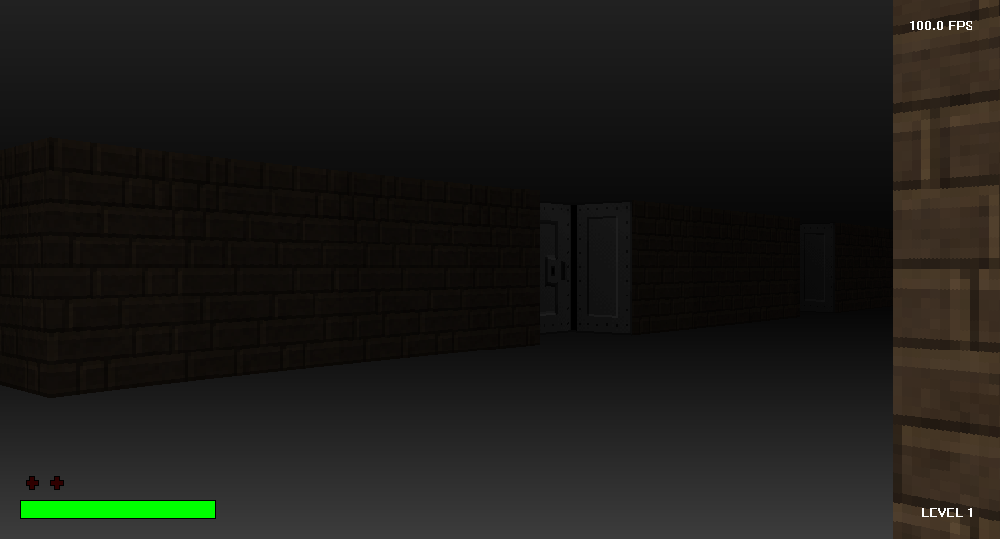
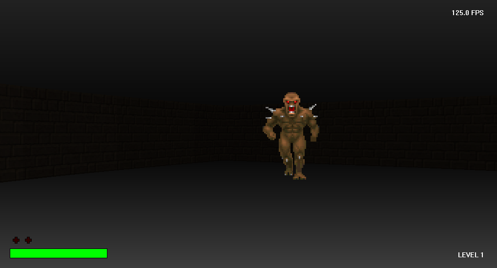
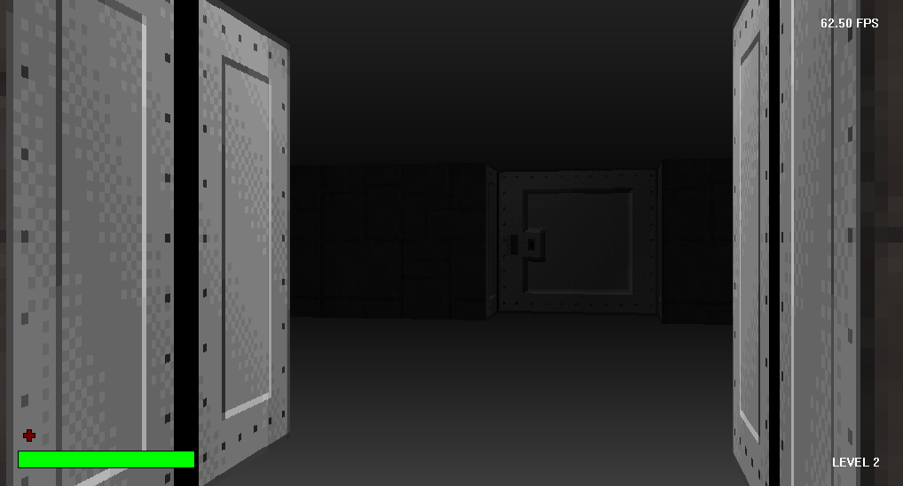

# The Escape

A first-person Wolfenstein 3D inspired game my colleague and I built for a school project.
The game is written in C++ and uses Windows GDI with a ray casting algorithm for rendering.

## Download

[Click here to download The Escape v1.0](https://github.com/mirzahalilcevic/TheEscape/releases/download/v1.0/TheEscape.zip)

## Screenshots

